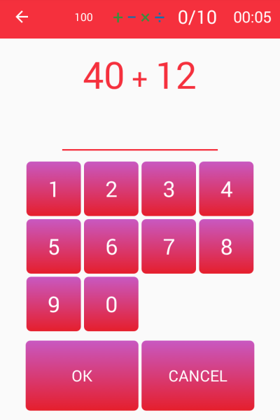

# Basic-Math-Exercises-App-Android
This Application is for students to practice basic math. This Application is based on [Privacy Friendly Reckoning Skills](https://github.com/SecUSo/privacy-friendly-reckoning-skills). It cuts down 80% of functionality.

Minimum android version is 18

## Screen shot

